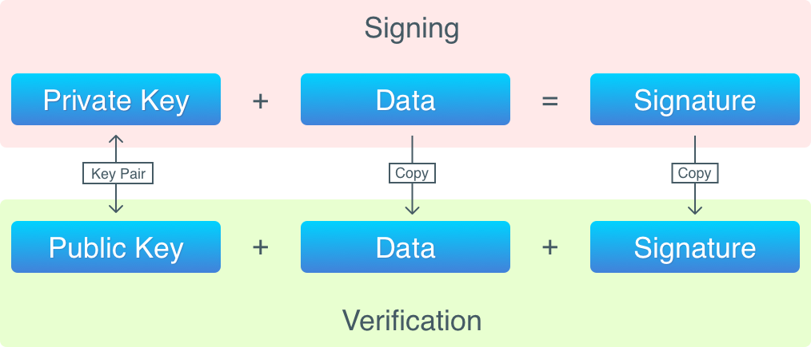

# Bitcoin Address

Bitcoin addresses are public. If you want to send coins to someone, you need to know their address. But addresses (despite being unique) are not something that identifies you as the owner of a “wallet”. In fact, such addresses are a human readable representation of public keys. 

In Bitcoin, your identity is a pair (or pairs) of private and public keys stored on your computer (or stored in some other place you have access to). Bitcoin relies on a combination of cryptography algorithms to create these keys, and guarantee that no one else in the world can access your coins without getting physical access to your keys.

## Public-key Cryptography

## Digital Signatures

Algorithms that guarantee:

1. that data wasn’t modified while being transferred from a sender to a recipient;
2. that data was created by a certain sender;
3. that the sender cannot deny sending the data.

By applying a signing algorithm to data (i.e., signing the data), one gets a signature, which can later be verified. 

Digital signing happens with the usage of a private key, and verification requires a public key.

In order to **sign** data, we need the following things:

1. data to sign;
2. private key.

The operation of signing produces a signature, which is stored in transaction inputs.

In order to **verify** a signature, the following is required:

1. data that was signed;
2. the signature;
3. public key.

This process can be described as: check that this signature was obtained from this data with a private key used to generate the public key.

> Digital signatures are not encryption, you cannot reconstruct the data from a signature. 

> But, hold on, they are also not exactly hashes, signatures have key pairs thus making signature verification possible. 

> But, again hold on, they can still be used to encrypt data: a private key is used to encrypt, and a public key is used to decrypt the data.

A nice schematic to help:

The entire transaction using the signature is described in [transaction.md](./transaction.md)

For how the private (and public) keys are generated (read), follow [keys.md](./keys.md)