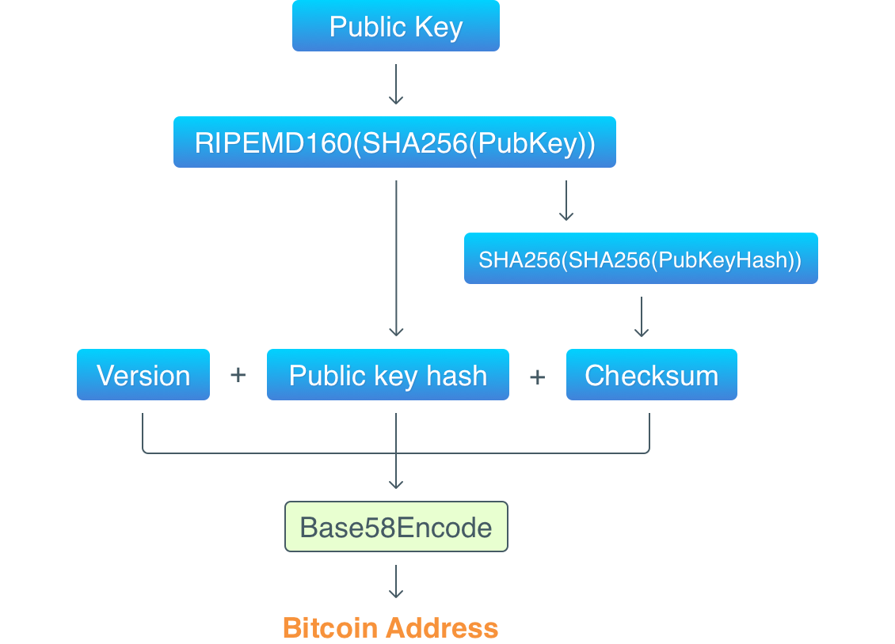

Public and private keys are sequences of random bytes. Since it’s private keys that are used to identify owners of coins, there’s a required condition: the randomness algorithm must produce truly random bytes. We don’t want to accidentally generate a private key that’s owned by someone else.

# Private Keys

Bitcoin uses elliptic curves to generate private keys. (hence, called Elliptic Curve Cryptography (ECC)). 

The curve used by Bitcoin can randomly pick a number between 0 and 2256 (which is approximately 1077, when there are between 1078 and 1082 atoms in the visible universe). Such a huge upper limit means that it’s **almost** impossible to generate the same private key twice.

Bitcoin uses the algorithm ECDSA (Elliptic Curve Digital Signature Algorithm) based on ECC to sign transactions.

# Public Keys

Bitcoin uses the Base58 algorithm to convert public keys into human readable format. (It uses a shorter alphabet: some letters were removed from the alphabet to avoid some attacks that use letters similarity.) These symbols are absent: 0 (zero), O (capital o), I (capital i), l (lowercase L) and also + and /. 

The process of getting an address from a public key can be schematically visualized below:

